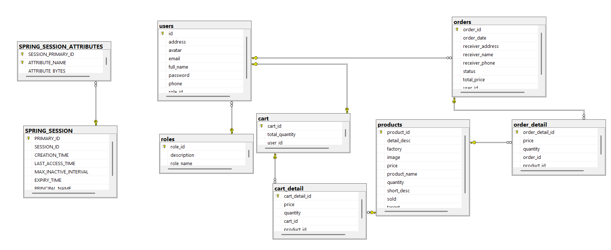

# 💻 Laptop Shop - E-commerce Website

[English](#english) | [Tiếng Việt](#tiếng-việt)

## English

A modern laptop e-commerce web application built with Spring Boot featuring session-based authentication and comprehensive product, order, and user management capabilities.

### 🚀 Tech Stack

- **Backend:** Spring Boot 3.3.4, Java 21
- **Security:** Spring Security with Session-based Authentication
- **Database:** SQL Server, Spring Data JPA, Hibernate
- **Frontend:** JSP, JSTL, Bootstrap 5
- **Session Management:** Spring Session JDBC
- **Build Tool:** Maven
- **Password Encoding:** BCrypt

### 📊 Database Schema



### ✨ Key Features

#### 👤 User Management System

- User registration/login with validation
- Role-based authorization: USER and ADMIN
- Personal information management
- Session-based authentication

#### 🛒 Shopping Features (User)

- Browse products with pagination
- Search and filter products
- Shopping cart management
- Checkout and order placement
- Order history tracking

#### 🏪 Admin Management

- Dashboard with overview statistics
- User management (CRUD operations)
- Product management (CRUD operations)
- Order management and tracking
- Product image upload functionality

### 🖼️ Application Interface

#### 🏠 Homepage (Client)


#### 📱 Product Page


#### 🛒 Shopping Cart


#### 💳 Checkout


#### ✅ Order Success


#### 📋 Order History


### 🔧 Admin Panel

#### 📊 Dashboard


#### 👥 User Management


#### 👤 User Information


#### 📦 Product Management


#### ✏️ Update Product


#### 📋 Order Details


#### 🔄 Update Order


### 🛠️ Installation & Setup

#### System Requirements

- Java 21+
- Maven 3.6+
- SQL Server
- IDE (IntelliJ IDEA, Eclipse, VS Code)

#### Step 1: Clone Repository

```bash
git clone https://github.com/hieuvolaptrinh/laptop.git
cd laptop/Laptop\ Shop
```

#### Step 2: Database Configuration

1. Create database in SQL Server:

```sql
CREATE DATABASE ShopHieuVo;
```

2. Update connection info in `application.properties`:

```properties
spring.datasource.url=jdbc:sqlserver://localhost:1433;databaseName=ShopHieuVo;encrypt=false
spring.datasource.username=sa
spring.datasource.password=your_password
```

#### Step 3: Run Application

```bash
# Using Maven wrapper
./mvnw spring-boot:run

# Or using Maven
mvn spring-boot:run
```

#### Step 4: Access Application

- **Client:** http://localhost:8080
- **Admin:** http://localhost:8080/admin

### 🔐 Default Account

After running the application for the first time, you can create an admin account through the registration page or insert directly into the database.

### 📁 Project Structure

```
src/
├── main/
│   ├── java/
│   │   └── start/spring/io/spring1/
│   │       ├── config/              # Security, MVC configuration
│   │       ├── controller/          # Controllers
│   │       │   ├── admin/          # Admin controllers
│   │       │   └── client/         # Client controllers
│   │       ├── domain/             # Entity classes
│   │       ├── repository/         # JPA Repositories
│   │       └── service/            # Business logic
│   ├── resources/
│   │   └── application.properties  # Application configuration
│   └── webapp/WEB-INF/view/
│       ├── admin/                  # Admin JSP pages
│       └── client/                 # Client JSP pages
```

### 🔒 Security System

- **Authentication:** Spring Security with custom UserDetailsService
- **Authorization:** Role-based (USER, ADMIN)
- **Session Management:** Spring Session JDBC
- **Password:** BCrypt encoding
- **CSRF Protection:** Enabled
- **Remember Me:** Supported

### 🌟 Highlights

- ✅ Responsive design with Bootstrap 5
- ✅ Session-based authentication
- ✅ File upload for product images
- ✅ Pagination for listings
- ✅ Input data validation
- ✅ Real-time cart management
- ✅ Dashboard with statistics
- ✅ Product search and filtering

---

## Tiếng Việt

Một ứng dụng web bán laptop được xây dựng bằng Spring Boot với hệ thống phân quyền dựa trên session, cho phép quản lý sản phẩm, đơn hàng và người dùng một cách hiệu quả.

## 🚀 Công nghệ sử dụng

- **Backend:** Spring Boot 3.3.4, Java 21
- **Security:** Spring Security với Session-based Authentication
- **Database:** SQL Server, Spring Data JPA, Hibernate
- **Frontend:** JSP, JSTL, Bootstrap 5
- **Session Management:** Spring Session JDBC
- **Build Tool:** Maven
- **Password Encoding:** BCrypt

## 📊 Database Schema


## ✨ Tính năng chính

### 👤 Hệ thống người dùng

- Đăng ký/Đăng nhập với validation
- Phân quyền: USER và ADMIN
- Quản lý thông tin cá nhân
- Session-based authentication

### 🛒 Chức năng mua hàng (User)

- Xem danh sách sản phẩm với phân trang
- Tìm kiếm và lọc sản phẩm
- Thêm vào giỏ hàng
- Thanh toán và đặt hàng
- Xem lịch sử mua hàng

### 🏪 Quản lý Admin

- Dashboard với thống kê tổng quan
- Quản lý người dùng (CRUD)
- Quản lý sản phẩm (CRUD)
- Quản lý đơn hàng
- Upload hình ảnh sản phẩm

## 🖼️ Giao diện ứng dụng

### 🏠 Trang chủ (Client)


### 📱 Trang sản phẩm


### 🛒 Giỏ hàng


### 💳 Thanh toán


### ✅ Đặt hàng thành công


### 📋 Lịch sử mua hàng


## 🔧 Admin Panel

### 📊 Dashboard


### 👥 Quản lý người dùng


### 👤 Thông tin người dùng


### 📦 Quản lý sản phẩm


### ✏️ Cập nhật sản phẩm


### 📋 Chi tiết hóa đơn


### 🔄 Cập nhật đơn hàng


## 🛠️ Cài đặt và chạy ứng dụng

### Yêu cầu hệ thống

- Java 21+
- Maven 3.6+
- SQL Server
- IDE (IntelliJ IDEA, Eclipse, VS Code)

### Bước 1: Clone repository

```bash
git clone https://github.com/hieuvolaptrinh/laptop.git
cd laptop/Laptop\ Shop
```

### Bước 2: Cấu hình database

1. Tạo database trong SQL Server:

```sql
CREATE DATABASE ShopHieuVo;
```

2. Cập nhật thông tin kết nối trong `application.properties`:

```properties
spring.datasource.url=jdbc:sqlserver://localhost:1433;databaseName=ShopHieuVo;encrypt=false
spring.datasource.username=sa
spring.datasource.password=your_password
```

### Bước 3: Chạy ứng dụng

```bash
# Sử dụng Maven wrapper
./mvnw spring-boot:run

# Hoặc sử dụng Maven
mvn spring-boot:run
```

### Bước 4: Truy cập ứng dụng

- **Client:** http://localhost:8080
- **Admin:** http://localhost:8080/admin

## 🔐 Tài khoản mặc định

Sau khi chạy ứng dụng lần đầu, bạn có thể tạo tài khoản admin thông qua trang đăng ký hoặc insert trực tiếp vào database.

## 📁 Cấu trúc project

```
src/
├── main/
│   ├── java/
│   │   └── start/spring/io/spring1/
│   │       ├── config/              # Cấu hình Security, MVC
│   │       ├── controller/          # Controllers
│   │       │   ├── admin/          # Admin controllers
│   │       │   └── client/         # Client controllers
│   │       ├── domain/             # Entity classes
│   │       ├── repository/         # JPA Repositories
│   │       └── service/            # Business logic
│   ├── resources/
│   │   └── application.properties  # Cấu hình ứng dụng
│   └── webapp/WEB-INF/view/
│       ├── admin/                  # Admin JSP pages
│       └── client/                 # Client JSP pages
```

## 🔒 Hệ thống bảo mật

- **Authentication:** Spring Security với UserDetailsService tùy chỉnh
- **Authorization:** Role-based (USER, ADMIN)
- **Session Management:** Spring Session JDBC
- **Password:** BCrypt encoding
- **CSRF Protection:** Enabled
- **Remember Me:** Supported

## 🌟 Điểm nổi bật

- ✅ Responsive design với Bootstrap 5
- ✅ Session-based authentication
- ✅ File upload cho hình ảnh sản phẩm
- ✅ Phân trang cho danh sách
- ✅ Validation dữ liệu đầu vào
- ✅ Quản lý giỏ hàng real-time
- ✅ Dashboard với thống kê
- ✅ Tìm kiếm và lọc sản phẩm

## 📧 Liên hệ & Thông tin cá nhân

- **Tên:** Võ Nguyễn Đại Hiếu
- **Nghề nghiệp:** Software Developer / Full-stack Developer
- **Trường:** Đại Học Sư Phạm Kỹ Thuật TP.HCM
- **Chuyên ngành:** Công nghệ phần mềm
- **Email:** vndhieuak@gmail.com
- **Địa chỉ:** 49 Cao Thắng - Đại Học Sư Phạm Kỹ Thuật
- **Github:** [hieuvolaptrinh](https://github.com/hieuvolaptrinh)
- **Facebook:** [Hiếu Võ](https://www.facebook.com/HieuVo.hv)
- **LinkedIn:** [Võ Nguyễn Đại Hiếu](https://www.linkedin.com/in/hieuvolaptrinh)

## 💝 Donate

Nếu bạn thấy project này hữu ích và muốn ủng hộ để tôi có thể phát triển thêm nhiều project khác, bạn có thể donate qua:

**🏦 Vietcombank**

- **Số tài khoản:** `1025212713`
- **Chủ tài khoản:** `VÕ NGUYỄN ĐẠI HIẾU`
- **Chi nhánh:** Vietcombank

_Mọi sự ủng hộ đều được đánh giá cao! 🙏_

## 📄 License

This project is licensed under the MIT License.

---

⭐ **Star this repository if you find it helpful!** ⭐
